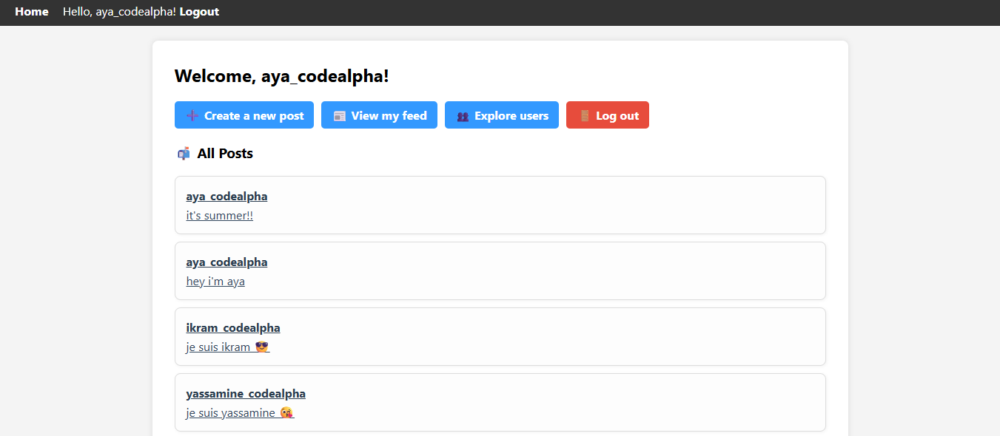
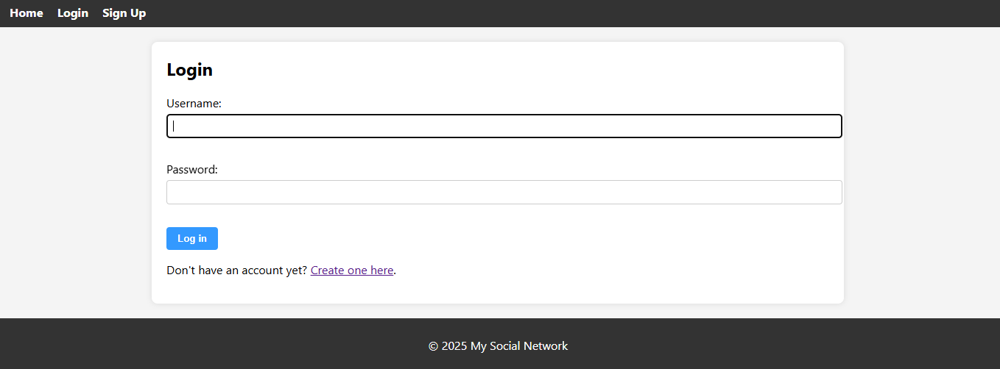
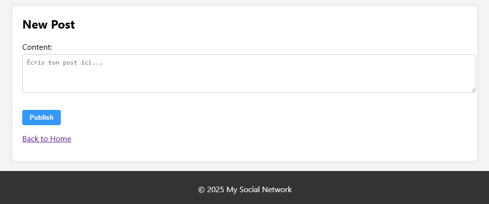
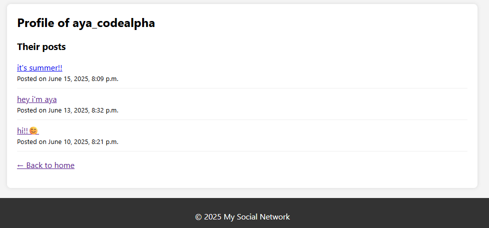
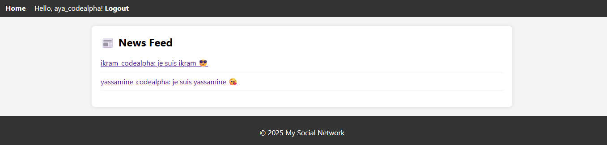

# 👥 Mini Social Network – CodeAlpha Internship (Task 2)

This is a mini social media web application built with **Django**, developed as part of **Task 2** of the CodeAlpha Internship Program.

---

## 🛠️ Technologies Used

- **Backend**: Django (Python)
- **Frontend**: HTML, CSS, Vanilla JavaScript
- **Database**: SQLite
- **Authentication**: Django built-in user system

---

## ✨ Features

- 🔐 User registration & login
- 📝 Create and view posts
- ❤️ Like posts
- 💬 Comment on posts
- 👤 Follow/unfollow users
- 📰 Personalized news feed (from followed users)
- 📄 User profile page with post list
- 📱 Responsive design & client-side form validation

---

---

## 📷 Screenshots

### 🏠 Homepage

### 🔐 Login Page

### 📝 Create Post Page

### 👤 User Profile

### 📰 Feed

---

## 🚀 How to Run Locally

# Clone the repository
git clone https://github.com/codealpha-talent/CodeAlpha_MiniSocialNetwork.git
cd CodeAlpha_MiniSocialNetwork

# Create virtual environment (optional)
python -m venv env
env\Scripts\activate  # Windows

# Install dependencies
pip install -r requirements.txt  # Or install manually

# Apply migrations
python manage.py migrate

# Run the development server
python manage.py runserver

Then visit: http://127.0.0.1:8000

---

## 👩‍💻 Author

**Aya Boussader**  
Second-year student at ENSA Marrakech  
Created for the **CodeAlpha Summer Internship 2025**

---

## 📜 License

This project is open source and free to use.

 
